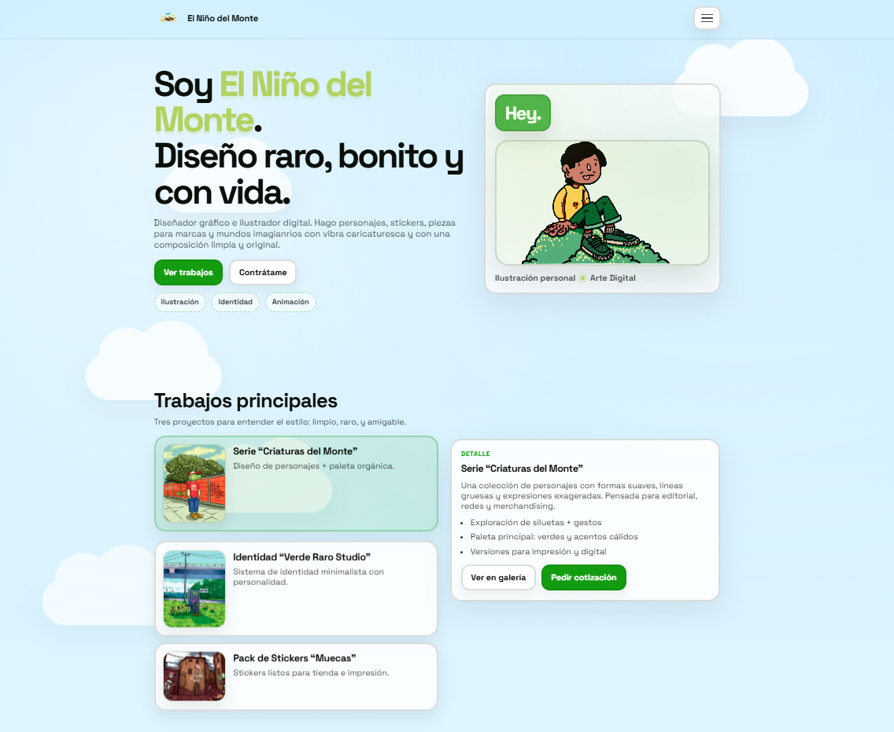

# El Niño del Monte — Portafolio

Portafolio web de **El Niño del Monte** (ilustración y diseño).  
Sitio **one-page**, responsivo, con animaciones sutiles y componentes interactivos (menú hamburguesa, reveal on scroll, tilt y galería tipo “stacked cards”).

---

## ✨ Características

- **Arquitectura CSS con metodología BEM** (Bloque, Elemento, Modificador)
- **Estructura modular** por carpetas: `base / layout / components / blocks`
- **Menú hamburguesa** accesible (`aria-expanded`, `aria-controls`)
- **Reveal on scroll** con `IntersectionObserver`
- **Tilt effect** sutil (hover/track del mouse)
- **Galería dinámica** con tarjetas apiladas:
  - Drag (mouse/touch)
  - Flechas (botones)
  - Flechas del teclado
  - Trackpad (scroll horizontal)
- Sección de **productos** con botón “Comprar” (demo)
- **Formulario de contacto** (demo) con feedback de estado
- **Footer** con año dinámico

---

## 🧱 Tecnologías

- **HTML5**
- **CSS3** (BEM + módulos por `@import`)
- **JavaScript (Vanilla)** (sin frameworks)
- Tipografía: **Space Grotesk** (Google Fonts)

---

## 📁 Estructura del proyecto

> Esta estructura asume la versión refactorizada con BEM:

```txt
/tu-proyecto
├─ index.html
├─ assets/
│  ├─ preview.jpg
│  ├─ logo2.png
│  ├─ NdelMonteHero2.png
│  ├─ work-*.jpg
│  ├─ product-*.jpg
│  ├─ artist.jpg
│  └─ 77xx.png
├─ css/
│  ├─ main.css
│  ├─ base/
│  │  ├─ variables.css
│  │  ├─ reset.css
│  │  └─ utilities.css
│  ├─ layout/
│  │  └─ layout.css
│  ├─ components/
│  │  ├─ button.css
│  │  ├─ chip.css
│  │  ├─ social.css
│  │  └─ burger.css
│  └─ blocks/
│     ├─ sky.css
│     ├─ header.css
│     ├─ section.css
│     ├─ hero.css
│     ├─ works.css
│     ├─ gallery.css
│     ├─ products.css
│     ├─ about.css
│     ├─ patreon.css
│     ├─ contact.css
│     ├─ footer.css
│     └─ reveal.css
└─ js/
   └─ app.js
```

## 🧩 Convenciones BEM usadas

**Bloque:**  
`.work-card`

**Elemento:**  
`.work-card__thumb`

**Modificador:**  
`.work-card--active`

### Ejemplos usados en el proyecto

- `.nav__panel` / `.nav__link--cta`
- `.sky__cloud--1 ... --5`
- `.gallery-card__label`
- `.product-card__price`

---

## Utilities (helpers)

Algunas clases se manejan como **utilidades** por ser comportamientos transversales:

- `.u-tilt` → habilita el efecto tilt
- `.u-reveal` → animación de entrada con `IntersectionObserver`
- `.u-img-cover` → `object-fit: cover` para imágenes
- `.u-accent` → color acento del texto

---

## JavaScript estable con `data-js`

El JS prioriza selectores por `data-js` para que puedas renombrar clases BEM sin romper la lógica.

### Ejemplos

- `data-js="navToggle"`, `data-js="navPanel"`
- `data-js="galleryStage"`, `data-js="galleryPrev"`, `data-js="galleryNext"`
- `data-js="buyBtn"`
- `data-js="contactForm"`, `data-js="formNote"`

---

## ♿ Accesibilidad

**Botón de menú con:**

- `aria-expanded`
- `aria-controls`
- `aria-label` dinámico

**Galería con:**

- Soporte teclado (flechas)
- Soporte touch

**Secciones con:**

- `aria-live` donde aplica (detalle de trabajos)

---

## 🛠️ Personalización rápida

- **Colores / estilo global:** `css/base/variables.css`
- **Assets:** `assets/`
- **Datos de trabajos (texto):** `js/app.js` → `workData`
- **Items de galería:** `js/app.js` → `galleryItems`
- **Productos:** contenido en `index.html` (cards)

---

## 📄 Licencia

Este proyecto es un portafolio personal.  
Si lo reutilizas como base, considera dar crédito y reemplazar assets/branding por los tuyos.

---

## 👤 Autor

**Oscar Monroy** (desarrollo)  
Sitio para **El Niño del Monte** (contenido / arte)
